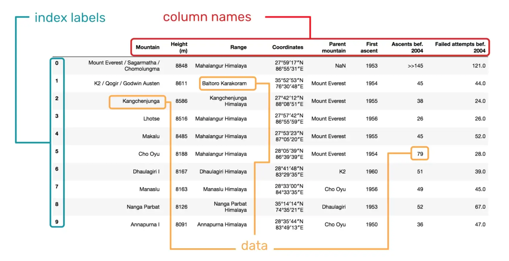
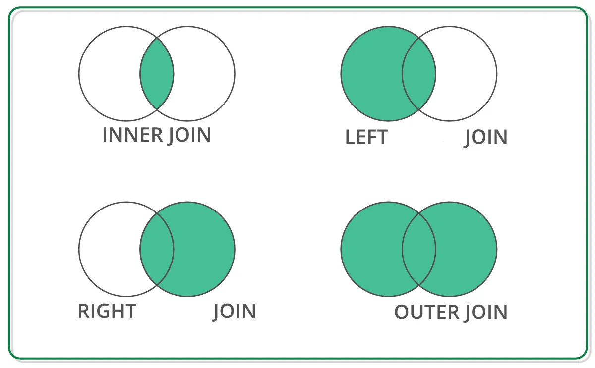

::: {.content-visible when-profile="fr"}
# Introduction - traiter des données tabulaires avec Polars

L'analyse statistique a généralement pour base des **données tabulaires**, dans lesquelles chaque ligne représente une observation et chaque colonne une variable.
Pour traiter ce type de données et y appliquer facilement les méthodes d'analyse de données standards, des objets dédiés ont été conçus : les `DataFrames`.
Les utilisateurs de `R` connaissent bien cette structure de données, qui est native à ce langage orienté statistique.
En `Python`, langage généraliste, cet objet n'existe pas nativement.
Plusieurs packages viennent ainsi combler ce manque, comme `pandas` ou `polars`.

## Pourquoi `polars`?

Comment choisir entre les deux ? Cela va dépendre de vos goûts et de vos besoins.
Mais voici en attendant quelques éléments pour savoir si `polars` est utile.

Du côté des atouts de Polars : 

- Polars est **rapide** et permet de traiter des **données volumineuses** : Selon un benchmark [effectué par H2O](https://h2oai.github.io/db-benchmark/),
Polars permet de traiter des données que d'autres librairies ne pourraient pas ()
et les traite aussi rapidement que le package `R` `data.table`. et 3 à 4 fois plus vite que d'autres librairies.

- Polars permet même de traiter des **données _out of memory_ :** `Polars` présente aussi l'avantage
de lire naturellement des jeux de données hors des limites de la mémoire de l'ordinateur grâce à [sa capacité de lire en flux](https://www.youtube.com/watch?v=3-C0Afs5TXQ) (méthode qu'on appelle le _streaming_).

- Polars permet une **évaluation paresseuse** (*lazy evaluation*) : ce mode de calcul
permet d'optimiser vos traitements pour proposer une exécution plus rapide
(pour la lecture comme pour la transformation des jeux de données).
Elle peut permettre d'avancer un `select` ou un `filter` si les opérations ultérieures
ne sont pas impactées.
Ces optimisations sont détaillées dans la [documentation officielle](https://pola-rs.github.io/polars-book/user-guide/optimizations/intro.html).

-  Une **API fluide** : L'API proposée par Polars est à la fois expressive et transparente. Ceci répond notamment aux commentaires sur `pandas`, où la syntaxe de manipulations des données est parfois complexe ou peu lisible et les choix d'écriture ne sont pas transparents du point de vue des performances.

- Un **pipe natif** : On retrouve une sémantique d'opérations de haut niveau qui s'enchaînent à la manière de [ce que l'on peut faire en `dplyr`](https://www.book.utilitr.org/03_fiches_thematiques/fiche_tidyverse#comment-utiliser-lop%C3%A9rateur-pipe-avec-le-tidyverse).

Polars présente quand même aussi quelques **inconvénients**, notamment lié à sa plus grande jeunesse.

- ainsi, le **traitement de données catégorielles** est encore instable, notamment en comparaison à pandas et 
au tidyverse. 
Dans Polars pour contourner ces problèmes, on a tendance à traiter ces variable catégorielles comme des caractères.

- **Pas (encore) de `geopolars`** : Tout l'écosystème autour de `pandas` n'a ainsi pas forcément (encore) d'équivalent en polars.
Pour les données géolocalisées par exemple, geopolars n'existe pas encore. 

- plus généralement, **`Polars` reste moins répandu que `pandas`** : Polars étant plus récent, il est en général moins bien interfacé avec les autres
librairies de data science, même si certaines commencent à accepter des données
`polars` en entrée.
La rapidité et simplicité de Polars permet cependant facilement de repasser à un
dataframe pandas pour les librairies qui n'accepteraient pas encore de dataframe
polars en entrée.


## Petits conseils pour commencer
Avant de commencer à utiliser Polars, voici quelques conseils à garder en tête : 

- L'import de données est **plus délicat** : 
Polars est très strict sur les types des colonnes quand on importe des données.
Il est courant de passer du temps à débugger cette étape, notamment pour s'assurer
que le code soit résistant à de légères variations dans le format des données d'entrée.
Pour optimiser ce temps là, on peut spécifier directement les types en entrée. 

-  Les **chaines de caractères sont par défaut associées à des colonnes** : 
En Polars, les caractères simples `"myvar"` sont par défaut considéré comme des noms de 
colonne. Il faut penser à utiliser `pl.lit("myvar")` pour signaler qu'il ne s'agit 
pas d'un nom de colonne. 

- **l'index de pandas** est mort <3 : comme dans le tidyverse, polars 
n'utilise pas d'index, et c'est très bien comme cela !

- les `polars selectors` sont très pratiques pour sélectionner des colonnes.
Ils permettent de sélectionner des colonnes avec des regex sur leurs noms ou bien
en fonction de leur type de données.
Plus d'exemples sont disponibles dans la [documentation officielle](https://docs.pola.rs/api/python/stable/reference/selectors.html).


## Allons-y !

On commence par importer la librairie `Polars`.
L'usage est courant est de lui attribuer l'alias `pl` afin de simplifier les
futurs appels aux objets et fonctions du package.

```{python}
import polars as pl
import polars.selectors as cs
```


## pour aller plus loin

Voici un ensemble de ressources si vous voulez aller plus loin sur l'écosystème
de Polars :

- [Blog Awesome Polars](https://ddotta.github.io/awesome-polars/), par Damien D
- [Blog sur Polars sur le site du SSPHub](https://ssphub.netlify.app/post/polars/)
- [Notebook Polars](https://datalab.sspcloud.fr/launcher/ide/jupyter-python?name=Tutoriel%20Polars&version=2.3.28&s3=region-79669f20&init.personalInit=«https%3A%2F%2Fraw.githubusercontent.com%2Fntoulemonde%2Ftest%2Frefs%2Fheads%2Fmain%2Finit.sh»&autoLaunch=true)


::: {.panel-tabset group="polars_vs_tidypolars" name="Pour commencer"}

## Polars
```{python}
import polars as pl
import numpy as np
```

## Tidypolars
Pour celles et ceux qui veulent utiliser des fonctions presqu'identiques à celles du tidyverse,
il y a le package [tidypolars](https://tidypolars.readthedocs.io/en/latest/).

Les noms des fonctions dans tidypolars sont presque tous identiques à ceux du tidyverse:

- un `DataFrame` de Polars devient un `tibble` chez tidypolars;
- la structure de la création d'un `tibble` est la même que dans R;
- les méthodes `filter`, `select` de Polars restent les mêmes;
- la méthode `with_columns` de Polars devient `mutate`  ...

Tidypolars reprend ainsi exactement la syntaxe des principales fonctions de dplyr, tidyr, stringr, lubridate, tidyselect directement dans Python!
La liste complète des fonctions reprises est disponible dans la [documentation](https://tidypolars.readthedocs.io/en/latest/reference.html).

La seule différence notable entre tidypolars et R est liée aux colonnes, qui sont accessibles par `pl.col/tp.col` dans `polars/tidypolars` quand dans R leur nom seul suffit.

Pour la simplicité du tutoriel, le tutoriel présente le début avec tidypolars mais ensuite  utilise uniquement Polars.
Pour plus de détail, allez voir la [documentation](https://tidypolars.readthedocs.io/en/latest/reference.html) !

```{python}
import polars as pl
import tidypolars as tp

from tidypolars import col
```

:::


# C'est parti avec la structure des données

## Le `DataFrame`

Fondamentalement, un DataFrame consiste en une collection de Series. Cette concaténation construit donc une table de données, dont les Series correspondent aux colonnes. La figure suivante ([source](https://www.geeksforgeeks.org/creating-a-pandas-dataframe/)) permet de bien comprendre cette structure de données.

{fig-align="center" width="800"}

Un DataFrame peut être construit de multiples manières. En pratique, on construit généralement un DataFrame directement à partir de fichiers de données tabulaires (ex : CSV, excel), rarement à la main. On illustrera donc seulement la méthode de construction manuelle la plus usuelle : à partir d'un dictionnaire de données.

::: {.panel-tabset group="polars_vs_tidypolars"}

## Polars

```{python}
df = pl.DataFrame(
    data = {
        "var1": [1.3, 5.6, None, None, 0, None],
        "experiment": ["test", "train", "test", "train", "train", "validation"],
        "date": ["2022-01-01", "2022-01-02", "2022-01-03", "2022-01-04", "2022-01-05", "2022-01-06"],
        "sample": "sample1"
    }, strict=False
)

df
```

## Tidypolars

```{python}

df = tp.tibble(
    var1 = [1.3, 5.6, None, None, 0, None],
    experiment = ["test", "train", "test", "train", "train", "validation"],
    date = ["2022-01-01", "2022-01-02", "2022-01-03", "2022-01-04", "2022-01-05", "2022-01-06"],
    sample = "sample1"
)

df

```

:::


A noter qu'une valeur manquante est indiquée par `None` en Polars. Elle sera ensuite traduite en type Null interne à Polars.

Un DataFrame Polars dispose d'un ensemble d'attributs utiles que nous allons découvrir tout au long de ce tutoriel. Pour l'instant, intéressons-nous aux plus basiques : le nom des colonnes.

```{python}
df = pl.DataFrame(
    data = {
        "var1": [1.3, 5.6, None, None, 0, None],
        "experiment": ["test", "train", "test", "train", "train", "validation"],
        "date": ["2022-01-01", "2022-01-02", "2022-01-03", "2022-01-04", "2022-01-05", "2022-01-06"],
        "sample": "sample1"
    }, strict=False
)

df.columns
```

Les principaux autres attributs d'un dataframe sont :
- liés à la taille du data frame :
    - le nombre de ligne (df.height) et de colonnes (df.width)
    - la forme globale (df.shape), qui reprend le nombre de lignes et de colonnes
- liés aux formats des colonnes:
    - le schéma du dataframe (df.schema)
    - les formats des colonnes (df.dtypes)

# Sélectionner des données

Lors de la manipulation des données tabulaires, il est fréquent de vouloir extraire des colonnes spécifiques d'un `DataFrame`.
Cette extraction suit la même logique que le tidyverse avec `Polars`.
La méthode `select` permet de sélectionner sur les colonnes quand `filter` filtre les lignes.

## Sélectionner des colonnes

Que l'on veuille sélectionner une ou deux colonnes en `Polars`, la logique est similaire.

Pour extraire une seule colonne, on peut utiliser la syntaxe suivante :

```{python}
selected_column = df.select("var1")
selected_column
```

L'objet `selected_column` renvoie ici la colonne nommée `var1` du `DataFrame` `df`.
Contrairement à Pandas, ici on ne garde qu'une seule colonne du dataframe, on ne l'extrait pas.
L'objet `selected_columns` reste donc un dataframe de 1 colonne, et n'est pas une série Polars.
Si on sélectionnait 2 colonnes, cela serait ainsi aussi un dataframe.

::: {.callout-tip}
Si vous voulez transformer un dataframe en une série Polars, il faut utiliser la méthode `to_series()` ou reprendre la syntaxe de Pandas qui marche aussi en Polars :

```{python}
print(f'En passant par select.to_series(), la table \n {df.select('var1').to_series()} \n est de type {type(df.select('var1').to_series())}')
print(f'En passant par df[var1], la table \n {df['var1']} \n est aussi de type {type(df['var1'])}')
```

:::


Pour extraire plusieurs colonnes, il suffit de passer une liste des noms des colonnes souhaitées
ou sans passer par une liste, comme dans le tidyverse.

Cet extrait montre les colonnes `var1` et `experiment` du `DataFrame` `df`.

```{python}
print(df.select("var1", "experiment"))
print(df.select(["var1", "experiment"]))
```


## Sélectionner des lignes

En pratique, on souhaite souvent filtrer un DataFrame selon certaines conditions.
Dans ce cas, on se sert principalement de filtres booléens selon une logique similaire au tidyverse.
La principale différence tient au nommage des colonnes.
En effet, le nom de chaque colonne doit être entourée d'un sélecteur `pl.col`.

Quand en R on écrirait

```r
df |>
    filter(var1>=0)
```

en Polars, on va l'écrire

```{python}
print(df.filter(pl.col('var1')>=0))
print(df.filter(pl.col.var1 >= 0))
```

Il y a deux manières de sélectionner une colonne : avec `pl.col('colname')` ou `pl.col.colname`.
Ce sera selon votre goût :)

- **Inégalités** : On peut vouloir garder seulement les lignes qui respectent une certaine condition.

Exemple, filtrer les lignes où la valeur de la colonne `var1` est supérieure à 0 :

```{python}
df.filter(pl.col('var1') >= 0)
```


- **Appartenance avec `is_in`** : Si on veut filtrer les données basées sur une liste de valeurs possibles, la méthode `is_in` est très utile.

Exemple, pour garder uniquement les lignes où la colonne `experiment` a des valeurs 'test' ou 'validation' :

```{python}
df.filter(pl.col('experiment').is_in(['train', 'validation']))
```

Ces méthodes peuvent être combinées pour créer des conditions plus complexes.
Il est aussi possible d'utiliser les opérateurs logiques (`&` pour "et", `|` pour "ou") pour combiner plusieurs conditions.
Par défaut, les filtres sont considérés comme des "et" : filter(condA, condB) renverra quand condA et condB sont vraies.
**Attention à ne pas oublier les parenthèses pour délimiter les conditions !**

Exemple :
- sélectionner les lignes où `var1` est supérieur à 0 **et** `experiment` est égal à 'test' ou 'validation':

```{python}
df.filter((pl.col("var1") >= 0) & pl.col("experiment").is_in(['train', 'validation']))
# équivalent à
df.filter(pl.col("var1") >= 0, pl.col("experiment").is_in(['train', 'validation']))
```

- sélectionner les lignes où `var1` est supérieur à 0 **ou** `experiment` est égal à 'test' ou 'validation':

```{python}
df.filter((pl.col("var1") >= 0) | pl.col("experiment").is_in(['train', 'validation']))
```

:::::: {.callout-note}
La méthode `filter` marche aussi sur des calculs à base des colonnes. Par exemple, si l'on veut sélectionner les observations faites le 2 du mois, on peut effectuer cela en une ligne (on verra plus tard le travail sur les données temporelles): 

```{python}
df.filter(pl.col('date').str.to_date("%Y-%m-%d").dt.day()==2)
```
:::

# Explorer des données tabulaires

En statistique publique, le point de départ n'est généralement pas la génération manuelle de données, mais plutôt des fichiers tabulaires préexistants.
Ces fichiers, qu'ils soient issus d'enquêtes, de bases administratives ou d'autres sources, constituent la matière première pour toute analyse ultérieure.
Polars offre des outils puissants et très rapides pour importer ces fichiers tabulaires et les explorer en vue de manipulations plus poussées.

## Importer et exporter des données

Polars est très sensible au format des données, l'import peut donc parfois être un peu long à débuger quand il n'arrive pas à déterminer le format de données de la colonne.
En effet, Polars va traiter chaque colonne comme une série d'un des formats qu'il connaît.
Les formats de données sont détaillés dans la [documentation de Polars](https://docs.pola.rs/api/python/stable/reference/datatypes.html).
Ils comprennent principalement:

| Famille de format | Format Polars | Remarques |
| -- | -- | -- |
| Caractères | - `pl.String` <br> - `pl.Utf8` | les données catégorielles (`pl.Categorical`) sont encore peu matures dans Polars. <br> Il peut donc mieux valoir les traiter simplement comme des caractères usuels. |
| Nombres | | |
|    - entiers | - `pl.Int8` <br> - `pl.Int16` <br> - `pl.Int32` ... | |
|    - numérique | - `pl.Float16` <br> - `pl.Float32` <br> - `pl.Float64`  | |
| Temporelles | - `pl.Date` <br> - `pl.Datetime` <br> - `pl.Duration` ... | |
| Structures imbriquées   | | - le format `pl.Struc` très pratique pour lire des formats imbriqués comme des JSON |
| Valeurs manquantes   | | Polars traite les valeurs manquantes à part. |

::: {.callout-caution}
A noter que pour Polars, les types `null` et `nan` sont différents.
`null` est une valeur manquante, quelque soit le type de valeur (caractère, numérique, temporelle,
imbriquée ...). On le déclare avec un `None`.
`NaN`, qui signifie _Not a Number_, est une valeur manquante **numérique** (et non pour les entiers).
Cela signifie que Polars le traite comme un nombre particulier.
On déclare un `NaN` soit en utilisant Numpy `np.nan`, soit une syntaxe de Polars : `float("nan")`.

Plus de détail sur la [documentation](https://docs.pola.rs/user-guide/expressions/missing-data/#null-and-nan-values).
:::

On peut convertir une colonne d'un type à l'autre avec la méthode `cast` en indiquant
dans un dictionnaire le nom de la colonne et le format Polars souhaité.

Par exemple, dans la table `df` définie ci-dessus, Polars a assigné les formats suivants :

```{python}
df.schema
```

On peut convertir `var1` en caractère et `date` en un format temporel par exemple :

```{python}
df.cast({"var1":pl.String, "date":pl.Date})
```

### Importer un fichier CSV

Comme nous l'avons vu dans un précédent TP, le format CSV est l'un des formats les plus courants pour stocker des données tabulaires. Nous avons précédemment utilisé la librairie `csv` pour les manipuler comme des fichiers texte, mais ce n'était pas très pratique. Pour rappel, la syntaxe pour lire un fichier CSV et afficher les premières lignes était la suivante :

```{python}
import csv

rows = []

with open("data/departement2021.csv") as file_in:
    csv_reader = csv.reader(file_in)
    for row in csv_reader:
        rows.append(row)

rows[:5]
```

Avec Polars, il suffit d'utiliser la fonction `read_csv()` pour importer le fichier comme un DataFrame, puis la fonction `head()`.

```{python}
df_departements = pl.read_csv('data/departement2021.csv')
df_departements.head()
```

A la différence de Pandas et à la date d'écriture de ce tutoriel, Polars ne charge pas directement depuis une URL et ne dézippe pas encore automatiquement le fichier csv (_cf._ [discussion de cette problématique sur Github](https://github.com/pola-rs/polars/issues/19447)).
Soit on utilise la fonction idoine de `pandas` et après on transforme le dataframe en `polars` facilement grâce à la fonction `pl.from_pandas`.

```{python}
import pandas as pd
url = "https://www.insee.fr/fr/statistiques/fichier/2540004/nat2021_csv.zip"
pl.from_pandas(pd.read_csv(url, delimiter=";"))
```

Si l'on veut éviter une dépendance à `pandas` juste pour cette opération, il faut donc faire ces étapes soi-même pour le moment grâce aux packages `requests`et `zipfile`.
Prenons l'exemple d'un fichier CSV disponible sur le site de l'INSEE : le fichier des prénoms, issu des données de l'état civil.

```{python}
import requests

# Téléchargement et stockage du nom du fichier
url = "https://www.insee.fr/fr/statistiques/fichier/2540004/nat2021_csv.zip"
file_Path = url.split('/')[-1]

response = requests.get(url)
if response.status_code == 200:
    with open(file_Path, 'wb') as file:
        file.write(response.content)

# zipfile permet de dézipper les fichiers
from zipfile import ZipFile

# on charge le fichier télécharger et extraction dans un dossier temp/
with ZipFile(file_Path, 'r') as zObject:
    zObject.extractall(path="temp/")

```

Par exemple, une erreur sera causée ici à cause de types de données incohérentes détectées par Polars.
En regardant le message d'erreur, Polars traite la colonne `anais` comme un entier.
Mais la lecture de la valeur `XXXX` cause une erreur et n'est pas convertible en entier par Polars.

```{python}
#| eval: false
df_prenoms_url = pl.read_csv('temp/' + os.listdir('temp')[0], separator=";")
```

Dans ce cas, deux solutions existent :
- On peut dire à Polars de traiter toutes les colonnes comme des caractères avec infer_schema=False

```{python}
df_prenoms_url = pl.read_csv('temp/' + os.listdir('temp')[0], separator=";", infer_schema=False)
df_prenoms_url
```

- On peut aussi lui dire de traiter la valeur `XXXX` comme une valeur manquante.
Polars va alors assigner des types à chaque colonne qui ne seront pas toutes des caractères.

```{python}
df_prenoms_url = pl.read_csv('temp/'+os.listdir('temp')[0], separator=";", null_values=['XXXX'])
df_prenoms_url
```

Lorsqu'on travaille avec des fichiers CSV, il y a de nombreux arguments optionnels disponibles dans la fonction `read_csv()` qui permettent d'ajuster le processus d'importation en fonction des spécificités du fichier.
Ces arguments peuvent notamment permettre de définir un délimiteur spécifique (comme ci-dessus pour le fichier des prénoms), de sauter certaines lignes en début de fichier, ou encore de définir les types de données pour chaque colonne, et bien d'autres.
Tous ces paramètres et leur utilisation sont détaillés dans la [documentation officielle](https://docs.pola.rs/api/python/stable/reference/api/polars.read_csv.html#polars.read_csv).

```{python}
# Pour nettoyer les fichiers
!rm $file_Path
!rm temp -rf
```


### Exporter au format CSV

Une fois que les données ont été traitées et modifiées au sein de Polars, il est courant de vouloir exporter le résultat sous forme de fichier CSV pour le partager, l'archiver ou l'utiliser dans d'autres outils.
Polars offre une méthode simple pour cette opération : `write_csv()`.
Supposons par exemple que l'on souhaite exporter les données du DataFrame `df_departements` spécifiques aux cinq départements d'outre-mer.

```{python}
df_departements_dom = df_departements.filter(pl.col("DEP").is_in(["971", "972", "973", "974", "975"]))
df_departements_dom.write_csv('output/departements2021_dom.csv', separator=";")
```


### Importer un fichier Parquet

Le format Parquet est un autre format pour le stockage de données tabulaires, de plus en plus fréquemment utilisé.
Sans entrer dans les détails techniques, le format Parquet présente différentes caractéristiques qui en font un choix privilégié pour le stockage et le traitement de gros volumes de données.
En raison de ces avantages, ce format est de plus en plus utilisé pour la mise à disposition de données à l'Insee.
Il est donc essentiel de savoir importer et requêter des fichiers Parquet avec Polars.

Importer un fichier Parquet dans un DataFrame Pandas se fait tout aussi facilement que pour un fichier CSV.
La fonction se nomme `read_parquet()`.

```{python}
df_departements = pl.read_parquet('data/departement2021.parquet')
df_departements.head()
```

### Exporter au format Parquet

Là encore, tout se passe comme dans le monde des CSV : on utilise la méthode `write_parquet()` pour exporter un DataFrame dans un fichier Parquet.

```{python}
df_departements_dom = df_departements.filter(pl.col("DEP").is_in(["971", "972", "973", "974", "975"]))
df_departements_dom.write_parquet('output/departements2021_dom.parquet')
```

Une des grandes forces du format Parquet, en comparaison des formats texte comme le CSV, est sa capacité à stocker des méta-données, i.e. des données permettant de mieux comprendre les données contenues dans le fichier.
En particulier, un fichier Parquet inclut dans ses méta-données le schéma des données (noms des variables, types des variables, etc.), ce qui en fait un format très adapté à la diffusion de données.
Vérifions ce comportement en reprenant le DataFrame que nous avons défini précédemment.

```{python}
df = pl.DataFrame(
    data = {
        "var1": [1.3, 5.6, float("nan"), float("nan"), 0, float("nan")],
        "var2": np.random.randint(-10, 10, 6),
        "experiment": ["test", "train", "test", "train", "train", "validation"],
        "date": ["2022-01-01", "2022-01-02", "2022-01-03", "2022-01-04", "2022-01-05", "2022-01-06"],
        "sample": "sample1"
    },
    schema_overrides={
        "experiment": pl.Categorical,
        "date": pl.Date
        }
)

```

On utilise cette fois deux types de données spécifiques, pour les données catégorielles (`categorical`) et pour les données temporelles (`date`), comme présenté précédemment.
Le format des données est imprimé par Polars dans la sortie : on voit maintenant en
dessous du nom des colonnes que le format des colonnes `experiment` et `date` ont changé.
On verra plus loin dans le tutoriel comment utiliser ces types.

```{python}
df
```

Vérifions à présent que l'export et le ré-import de ces données en Parquet préserve le schéma.

```{python}
df.write_parquet("output/df_test_schema.parquet")
df_test_schema_parquet = pl.read_parquet('output/df_test_schema.parquet')

df_test_schema_parquet
```

A l'inverse, un fichier CSV ne contenant par définition que du texte, ne permet pas de préserver ces données.
Les variables dont nous avons spécifié le type sont importées comme des strings (type `object` en Polars).

```{python}
df.write_csv("output/df_test_schema.csv")
df_test_schema_csv = pl.read_csv('output/df_test_schema.csv')

df_test_schema_csv
```

### Importer depuis un dictionnaire

Comme illustré dans le tutoriel [Travailler avec des fichiers CSV et JSON](../csv-json-files/tutorial.qmd), on peut aussi créer un dataFrame Polars à partir d'un dictionnaire.
Cela sera très utile par exemple quand on récupère les données d'une API (_cf._ cours de
[Python pour la data-science](https://pythonds.linogaliana.fr/) et la partie sur les API).

Les méthodes `from_dict` et `from_dicts` permettent de créer des DataFrames à partir de dictionnaires.

- `from_dict` prend comme argument un **dictionnaire des colonnes**, de manière similaire à `pl.DataFrame` :
on va écrire par exemple `pl.from_dict({"a": [1, 2], "b": [3, 4]})`
- `from_dicts` par contre prend comme argument une **liste des lignes** : on va écrire par exemple `pl.from_dicts([{"a": 1, "b": 4}, {"a": 2, "b": 5}, {"a": 3, "b": 6}])`

```{python}
import requests
import json

response = requests.get("https://data.geopf.fr/geocodage/search?q=comedie&type=street")
```

Le résultat de la requête est un dictionnaire avec 3 clés, dont la deuxième, 'features', stocke les résultats sous forme d'une liste.
Pour importer directement ce fichier en Polars, on peut utiliser la méthode from_dict ou from_dicts.

```{python}
df = pl.from_dicts(json.loads(response.text))
df.head(2)
```

On retrouve dans le DataFrame les trois colonnes dont la clé représente le nom de la colonne et la valeur dans le dictionnaire la valeur dans la colonne.
La première et dernière colonnes sont des valeurs constantes au format `pl.String` et les résultats sont stockés dans la colonne `features`.
Cette dernière est au format `pl.Struct`, qui fonctionne de manière similaire à un dictionnaire.

::: {.callout-tip}
La méthode `unnest` est **très pratique** en travaillant avec des formats JSON.
Elle permet facilement de passer d'un format structuré à un format plus standard (numérique ou textuel).
Ainsi, pour récupérer le détail des résultats de l'appel à l'API, il suffit d'utiliser la méthode `unnest`.
On l'applique à plusieurs reprises et on veille à supprimer les colonnes  intermédiaires qui ont des noms identiques pour *applatir* le data frame:

```{python}
df = df.select("features").unnest("features").drop('type').unnest('geometry').drop('type').unnest('properties')
```
:::


### Autres exports et imports

- **Exporter vers un dictionnaire**:
De manière similaire, Polars permet d'exporter un DataFrame vers un dictionnaire.

  - La méthode `to_dict` permet d'exporter un DataFrame "en format colonne".
L'export sera un seul dictionnaire dont les clés sont les noms des colonnes et
les valeurs les listes des valeurs prises par colonne `{'a':[1, 2, 3], 'b': [3, 2, 1]}`.
  - La méthode `to_dicts`permet d'exporter le DataFrame "en format ligne".
L'export sera une liste dont les termes seront les lignes du DataFrame,
représentées à chaque fois par un dictionnaire : `[{'a': 1, 'b': 3}, {'a': 2, 'b': 2}, {'a': 3, 'b': 1}]`

- **Depuis/vers Pandas**:
Polars permet aussi facilement d'exporter et d'importer des DataFrame au format Pandas.
Cela permet de travailler avec Polars et de convertir un DataFrame en Pandas quand un package n'autorise pas l'import depuis Polars.
Il suffit d'utiliser la fonction `pl.from_pandas(df)` et la méthode `df.to_pandas()`.

# Visualiser un échantillon des données

Lorsqu'on travaille avec des jeux de données volumineux, il est souvent utile de visualiser rapidement un échantillon
des données pour avoir une idée de leur structure, de leur format ou encore pour détecter d'éventuels problèmes.
Polars offre plusieurs méthodes pour cela.

Par défaut, Polars indique les cinq premières et cinq dernières lignes d'un DataFrame et indique la forme (_shape_).

```{python}
df_departements
```

La méthode `head()` permet d'afficher les premières lignes du DataFrame.
Par défaut, elle retourne les 5 premières lignes, mais on peut spécifier un autre nombre en argument si nécessaire.

```{python}
df_departements.head()
```

```{python}
df_departements.head(10)
```

À l'inverse, la méthode `tail()` donne un aperçu des dernières lignes du DataFrame.

```{python}
df_departements.tail()
```

L'affichage des premières ou dernières lignes peut parfois ne pas être représentatif de l'ensemble du jeu de données, lorsque les données sont triées par exemple. Afin de minimiser le risque d'obtenir un aperçu biaisé des données, on peut utiliser la méthode `sample()`, qui sélectionne un un échantillon aléatoire de lignes. Par défaut, elle retourne une seule ligne, mais on peut demander un nombre spécifique de lignes en utilisant l'argument `n`.

```{python}
df_departements.sample(n=5)
```

## Obtenir une vue d'ensemble des données

L'une des premières étapes lors de l'exploration de nouvelles données est de comprendre la structure générale du jeu de données.
La méthode `glimpse()` de Polars offre une vue d'ensemble rapide des données, notamment en termes de types de données et affiche les données.

```{python}
df.glimpse()
```

Plusieurs éléments d'information clés peuvent être extraits de ce résultat :

- **Taille de la table** : le nombre de ligne et de colonnes sont indiquées

- **schéma** : la liste des colonnes est affichée avec des informations très utiles sur le schéma des données :

  - **Format** : Le format Polars de données de la colonne, par exemple `<str>`pour un format caractère (ou `pl.String`).
  Cela permet de comprendre la nature des informations stockées dans chaque colonne.

  - **les premières valeurs** : après chaque colonne sont indiquées, à l'horizontale, les premières valeurs de la colonne.
  Cela permet de mieux comprendre le schéma du DataFrame.

Contrairement à Pandas, cette méthode n'affiche pas les valeurs manquantes.
Pour cela, il faut utiliser les statistiques descriptives.

## Calculer des statistiques descriptives

En complément des informations renvoyées par la méthode `glimpse()`, on peut vouloir obtenir des
statistiques descriptives simples afin de visualiser rapidement les distributions des variables.
La méthode `describe()` permet d'avoir une vue synthétique de la distribution des données dans chaque colonne.

```{python}
df.describe()
```

Notons que, là encore, la variable `count` renvoie le nombre de valeurs **non-manquantes** dans chaque variable.


# Principales manipulations de données

## Transformer les données

Les opérations de transformation sur les données sont essentielles pour façonner, nettoyer et préparer les données en vue de leur analyse.
Les transformations peuvent concerner l'ensemble du DataFrame, des colonnes spécifiques ou encore des lignes spécifiques.

### Transformer les colonnes

En équivalent de `mutate` du tidyverse ou du `replace` de pandas, Polars utilise `with_columns`.
Le fonctionnement est similaire au `mutate` du tidyverse.
Il permet ainsi de modifier des valeurs de colonne, d'effectuer des opérations etc.


La fonction with_columns fonctionne de  deux manières différentes :

    1. en utilisant une syntaxe plus proche du SQL et de Python, grâce à la méthode `.alias()`.
    2. plus similaire au tidyverse, en assignant les variables avec une équation

Par exemple, si l'on veut définir la colonne `b` comme la colonne `a` divisée par 2 , on va utiliser la formule suivante :

```{python}
df = pl.DataFrame({'a':np.random.randint(-10, 10, 6), 'b': np.random.randint(5, 15, 6)})

df.with_columns(
    # Première méthode :
    (pl.col("a")/2).alias("b"),
    (np.abs(pl.col("a"))).alias("abs_a"),
    # Ou l'autre méthode :
    b2=pl.col("a")/2,
    abs_a2=np.abs(pl.col("a"))
)

```


::: {.callout-tip}
La structure `pl.when` est très pratique et équivaut à la structure `ifelse` en R.

Par exemple, si je veux définir la colonne val à partir de la colonne foo selon le schéma : si foo > 2 : val = 1, sinon val = 1 + bar, cela s'écrite en polars :


```{python}
df = pl.DataFrame({'foo':np.random.randint(-10, 10, 6), 'bar': np.random.randint(5, 15, 6)})
df.with_columns(
    pl.when(pl.col('foo') > 2).then(1).otherwise(1 + pl.col('bar')).alias("val")
)
```

:::

::: {.callout-warning}

Attention, en Polars, les caractères simples sont assimilés aux  colonnes.
Pour insérer un caractère, utiliser pl.lit.

```{python}
df = pl.DataFrame({'foo':np.random.randint(-10, 10, 6), 'bar': np.random.randint(5, 15, 6)})
df.with_columns(
    val="foo",
    this_is_foo=pl.lit("foo")
)
```

:::

La méthodes fill_null permet de remplacer les valeurs manquante

```{python}
df.fill_null(strategy='zero')
```


Mais il existe d'autres transformations que l'on applique généralement au niveau d'une ou de quelques colonnes. Par exemple, lorsque le schéma n'a pas été bien reconnu à l'import, il peut arriver que des variables numériques soient définies comme des string.

```{python}
df = pl.DataFrame(
    data = {
        "var1": [1.3, 5.6, None],
        "var2": ["1", "5", "18"],
    }
)

df.glimpse()
```

Dans ce cas, on peut utiliser la méthode `cast` pour convertir la colonne dans le type souhaité en spécifiant avec un dictionnaire les colonnes à modifier.
Le dictionnaire est écrit sous le format `{'nom de la colonne 1':'type Polars à appliquer', 'nom de la colonne 2':'type Polars à appliquer'}`.
Les types sont décrits plus haut et dans la [documentation de Polars](https://docs.pola.rs/api/python/stable/reference/datatypes.html).

```{python}
df = df.cast({'var2':pl.Int32})

df.glimpse()
```

### Renommer des colonnes

Une autre opération fréquente est le renommage d'une ou plusieurs colonnes. Pour cela, on peut utiliser la méthode [rename()](https://docs.pola.rs/api/python/stable/reference/dataframe/api/polars.DataFrame.rename.html#polars.DataFrame.rename), à laquelle on passe un dictionnaire qui contient autant de couples clé-valeur que de variables à renommer, et dans lequel chaque couple clé-valeur est de la forme `'ancien_nom': 'nouveau_nom'`.

```{python}
df.rename({'var2': 'age'})
```


### Fonctions complexes

Néanmoins, on peut se retrouver dans certains (rares) cas où une opération ne peut pas être facilement vectorisée ou où la logique est complexe.
Supposons par exemple que l'on souhaite calculer la variation annuelle du PIB par pays dans une table comportant les pays et les années.

```{python}
# Données fictives de PIB par pays
df = pl.DataFrame({
    'country': ['France', 'France', 'France', 'Germany', 'Germany', 'Germany', 'UK', 'UK', 'UK'],
    'year': [2019, 2020, 2021, 2019, 2020, 2021, 2019, 2020, 2021],
    'gdp': [21.43, 20.21, 22.54, 1.73, 1.66, 1.78, 2.83, 2.71, 2.99]
})

# On définit une fonction dite User-defined-function (UDF) pour calculer la croissance par pays
def calculate_percentage_change(group):
    group = group.sort('year')
    group = group.with_columns(
        ((pl.col('gdp') - pl.col('gdp').shift(1)) / pl.col('gdp').shift(1) * 100).alias('percentage_change')
    )
    return group

# On applique la fonction en utilisant map_groups
print(df.group_by('country').map_groups(calculate_percentage_change))

```


## Trier les valeurs

Le tri des données est particulièrement utile pour l'exploration et la visualisation de données. Avec Polars, on utilise la méthode [sort()](https://docs.pola.rs/api/python/stable/reference/dataframe/api/polars.DataFrame.sort.html#polars.DataFrame.sort) pour trier les valeurs d'un DataFrame selon une ou plusieurs colonnes.

```{python}
df = pl.DataFrame(
    data = {
        "var1": [1, 9, 9, 14, 13],
        "var2": [3, 7, 11, 15, 4],
        "date": ["2022-01-01", "2022-01-02", "2022-01-03", "2022-01-04", "2022-04-02"],
    }
)

df
```

Pour trier les valeurs selon une seule colonne, il suffit de passer le nom de la colonne en paramètre.

```{python}
df.sort(by='var1')
```

Par défaut, le tri est effectué dans l'ordre croissant. Pour trier les valeurs dans un ordre décroissant, il suffit de paramétrer `descending=True`.

```{python}
df.sort(by='var1', descending=True)
```

Si on souhaite trier le DataFrame sur plusieurs colonnes, on peut fournir une liste de noms de colonnes. On peut également choisir de trier de manière croissante pour certaines colonnes et décroissante pour d'autres en spécifiant les booléns dans une liste.

```{python}
df.sort(by=['var1', 'var2'], descending=[True, True])
```


## Agréger des données

L'agrégation des données est un processus dans lequel les données vont être ventilées en groupes selon certains critères, puis agrégées selon une fonction d'agrégation appliquée indépendamment à chaque groupe. Cette opération est courante lors de l'analyse exploratoire ou lors du prétraitement des données pour la visualisation ou la modélisation statistique.

```{python}
df = pl.DataFrame(
    data = {
        "var1": [1.3, 5.6, None, None, 0, None],
        "var2": np.random.randint(-10, 10, 6),
        "experiment": ["test", "train", "test", "train", "train", "validation"],
        "date": ["2022-01-01", "2022-01-02", "2022-01-03", "2022-01-04", "2022-01-05", "2022-01-06"],
        "sample": "sample1"
    }
)

df.head()
```

### L'opération `group_by`

La méthode `group_by` de Polars permet de diviser le DataFrame en sous-ensembles selon les valeurs d'une ou plusieurs colonnes, puis d'appliquer une fonction d'agrégation à chaque sous-ensemble. Elle renvoie un objet de type `dataframe.group_by` qui ne présente pas de grand intérêt en soi, mais constitue l'étape intermédiaire indispensable pour pouvoir ensuite appliquer une ou plusieurs fonction(s) d'agrégation aux différents groupes.

```{python}
df.group_by('experiment')
```

### Fonctions d'agrégation

Une fois les données groupées, on peut appliquer des fonctions d'agrégation pour obtenir un résumé statistique. Polars intègre un certain nombre de ces fonctions qui  fonctionnent sur la table de donnée entière, *cf.* [liste complète dans la documentation](https://docs.pola.rs/api/python/stable/reference/dataframe/aggregation.html) ou sur des sous-ensembles de la table, en utilisant `group_by`, *cf.* [liste complète dans la documentation](https://docs.pola.rs/api/python/stable/reference/dataframe/group_by.html).


Voici quelques exemples d'utilisation de ces méthodes avec `group_by`.

Par défaut, Polars appliquera les fonctions usuelles à l'ensemble des colonnes.
Pour spécifier une colonne, il faut utiliser la fonction `agg`, détaillée plus bas.

- Par exemple, compter le nombre d'occurrences dans chaque groupe.

```{python}
df.group_by('experiment').count()
```

- Calculer la somme d'une variable par groupe.

```{python}
df.group_by('experiment').agg(pl.col('var2').sum())
```

::: {.callout-tip}
Polars a aussi introduit des wrappers utiles pour les fonctions principales d'aggregation sum, std, count, quantile, cum_count, cum_sum, max, min, median, sqrt.

Pour ces fonctions, on peut les appeler directement en faisant `pl.sum('var2')` et non `pl.col('var2').sum()`.

Par exemple :
```{.python}
df.group_by('experiment').agg(pl.sum('var2'))
```

est identique à :
```{.python}
df.group_by('experiment').agg(pl.col('var2').sum())
```

:::

- Ou encore compter le nombre de valeurs unique d'une variable par groupe. Les possibilités sont nombreuses.

```{python}
# Pour le nombre de valeurs uniques dans chaque groupe
df.group_by('experiment').agg(pl.col('var2').n_unique())
```

Lorsqu'on souhaite appliquer plusieurs fonctions d'agrégation à la fois ou des fonctions personnalisées, on utilise la méthode `agg`. Cette méthode fonctionne selon une structure similaire à `with_columns`. Elle permet de définir plus finement les fonctions d'agrégation.

```{python}
df.group_by('experiment').agg(
    pl.col('var1').mean().alias('mean_var1'),
    pl.col('var2').count().alias('count_var2')
)
```

::: {.callout-tip}
Au lieu d'utiliser la méthode alias, on peut utiliser l'attribut `name` de Polars qui renvoie le nom de la colonne et les fonctions associées. Plus de détails sont présentés dans la [documentation officielle](https://docs.pola.rs/api/python/stable/reference/expressions/name.html).

Par exemple, définir `.alias('mean_var1')` est l'équivalent de `.name.prefix('mean_')`
:::

::: {.callout-note title="Le chaînage de méthodes"}
Les exemples précédents illustrent un concept important en Polars : le chaînage de méthodes. Ce terme désigne la possibilité d'enchaîner les transformations appliquées à un DataFrame en lui appliquant à la chaîne des méthodes, comme le `pipe` du tidyverse. A chaque méthode appliquée, un DataFrame intermédiaire est créé (mais non assigné à une variable), qui devient l'input de la méthode suivante.

Le chaînage de méthodes permet de combiner plusieurs opérations en une seule expression de code. Cela peut améliorer l'efficacité en évitant les assignations intermédiaires et en rendant le code plus fluide et plus facile à lire.
Cela favorise également un style de programmation fonctionnel où les données passent à travers une chaîne de transformations de manière fluide.

```{.python}
subset_df = (
    df
    .filter(pl.col('sample') == "sample1", pl.col("date") >= '2022-01-02')
    .drop('sample')
    .glimpse()
)
```

:::

## Traiter les valeurs manquantes

Les valeurs manquantes sont une réalité courante dans le traitement des données réelles et peuvent survenir pour diverses raisons, telles que des non-réponses à un questionnaire, des erreurs de saisie, des pertes de données lors de la transmission ou simplement parce que l'information n'est pas applicable. Pandas offre plusieurs outils pour gérer les valeurs manquantes.

### Représentation des valeurs manquantes

On peut tout d'abord traiter les valeurs manquantes avec les méthodes associées.
Pour rappel, en Polars, les valeurs `NaN` et `null` sont différentes, alors qu'en Pandas elles sont traitées de manière similaire.

| | **Type `null`** | **Type `NaN`** |
|--|--|--|
| **Signification** | Seule `Null` est considéré par défaut comme une valeur manquante et est l'unique type de valeur manquante dans Polars (que le type original soit temporel, numérique, un charactère ...). | `NaN` représente à l'inverse des valeurs numériques erronées, comme le résultat d'une division par 0. |
| **Comment les créer ?** | Les valeurs manquantes peuvent être crées simplement avec `None`. | Pour créer une valeur `NaN`, valable uniquement pour les types numériques, on peut utiliser `np.nan` de NumPy ou `float("nan")` de Polars. |
| Comportement dans Polars | Ces valeurs sont en général **ignorées**. | Ces valeurs **se propagent**. |


Vérifions cette propriété.
Pour identifier où se trouvent les valeurs manquantes, on utilise la fonction `is_null()` ou `is_nan()` appliquée à une colonne.

```{python}
df = pl.DataFrame(
    data = {
        "var1": [1.3, 5.6, 2.2, 1.4, None, 1.7],
        "var2": np.append(np.random.randint(-10, 10, 5), np.nan),
        "experiment": ["test", "train", "test", None, "train", "validation"],
        "sample": "sample1"
    }
)
df.with_columns(
    var1_na=pl.col("var1").is_nan(),
    var1_null=pl.col("var1").is_null()
)
```

On peut à l'inverse éliminer les lignes qui comportent une valeur manquante ou un `NaN` :

```{python}
print(df.drop_nans())
print(df.drop_nulls())
```

### Calculs sur des colonnes contenant des valeurs manquantes

Lors de calculs statistiques, les valeurs nulles sont généralement ignorées en Polars. Par exemple, la méthode `.mean()` calcule la moyenne des valeurs non manquantes.

```{python}
df['var1'].mean()
```

En revanche, les valeurs 'Not a Number', ou `NaN`, ont plutôt tendance à se propager.

```{python}
df['var2'].mean()
```

### Suppression des valeurs manquantes

Les méthodes `drop_nulls()` et `drop_nans()` permettent de supprimer les lignes contenant des valeurs manquantes ou des NaN.

Par défaut, toute ligne contenant au moins une valeur manquante ou NaN est supprimée.

```{python}
df.drop_nans()
```

Si l'on spécifie une liste de colonnes, seules les lignes comportant une valeur manquante ou NaN de cette colonne seront supprimées.

```{python}
df.drop_nulls(['var1'])
```

### Remplacement des valeurs manquantes

Pour gérer les valeurs manquantes dans un DataFrame, une approche commune est l'imputation, qui consiste à remplacer les valeurs manquantes par d'autres valeurs. La méthode [`fill_null()`](https://docs.pola.rs/api/python/stable/reference/dataframe/api/polars.DataFrame.fill_null.html) permet d'effectuer cette opération de différentes manières dans toute la table de donnée.

- Une première possibilité est le remplacement par une valeur constante.

```{python}
df.fill_null(value=0)
```

::: {.callout-warning title="Changement de représentation des valeurs manquantes"}
Il peut parfois être tentant de changer la manifestation d'une valeur manquante pour des raisons de visibilité, par exemple en la remplaçant par une chaîne de caractères :

```{python}
df.fill_null(value="MISSING")
```

En pratique, cette façon de faire n'est pas recommandée. Il est en effet préférable de conserver la convention standard de `Polars` (l'utilisation des `null`), d'abord pour des questions de standardisation des pratiques qui facilitent la lecture et la maintenance du code, mais également parce que la convention standard est optimisée pour la performance et les calculs à partir de données contenant des valeurs manquantes.
:::

La méthide `fill_null()` de Polars propose 4 méthodes pré-définies pour remplacer les valeurs manquantes par l'argument `strategy`:
- toute valeur constante indiquée (`strategy=None`, argument par défaut);
- soit des 0, soit des 1 (`strategy="zero"`, `strategy="one"` :);
- en reportant la valeur précédente (`strategy=‘forward’`) ou la valeur suivante (`strategy=‘backward’`) de la colonne ;
- en indiquant le minimum, le maximum ou la médiane de la colonne (`strategy=‘min’`, `strategy=‘max’`, `strategy=‘mean’`).

Si l'on veut remplacer uniquement les valeurs manquantantes d'une colonne en Polars, il est plus utile d'utiliser la méthode `with_columns()` en utilisant l'agilité des sélecteurs de Polars.

```{python}
df.with_columns(
    pl.col(pl.NUMERIC_DTYPES).fill_null(strategy="mean")
)
```


::: {.callout-warning title="Biais d'imputation"}
Remplacer les valeurs manquantes par une valeur constante, telle que zéro, la moyenne ou la médiane, peut être problématique. Si les données ne sont pas manquantes au hasard (*Missing Not At Random* - *MNAR*), cela peut introduire un biais dans l'analyse. Les variables *MNAR* sont des variables dont la probabilité d'être manquantes est liée à leur propre valeur ou à d'autres variables dans les données. Dans de tels cas, une imputation plus sophistiquée peut être nécessaire pour minimiser les distorsions. Nous en verrons un exemple en exercice de fin de tutoriel.
:::

De manière similaire, la méthode `fill_nan()` permet de remplacer les valeurs numériques NaN par toute valeur indiquée.

# Traiter les données de types spécifiques

## Données textuelles

Les données textuelles nécessitent souvent un nettoyage et une préparation avant l'analyse.
Polars fournit via la librairie de méthodes `str` un ensemble d'opérations vectorisées qui rendent la préparation des données textuelles à la fois simple et très efficace.
La méthode `str` s'applique aux séries Polars.
Là encore, les possibilités sont multiples et détaillées dans la [documentation](https://docs.pola.rs/api/python/stable/reference/series/string.html).
Nous présentons ici les méthodes les plus fréquemment utilisées dans l'analyse de données.

```{python}
df = pl.DataFrame(
    data = {
        "var1": [1.3, 5.6, None, None, 0, None],
        "var2": np.random.randint(-10, 10, 6),
        "experiment": ["test", "train", "test", "test", "train", "validation"],
        "sample": ["  sample1", "sample1  ", " sample2 ", "   sample2   ", "sample2  ", "sample1"]
    }
)

df
```

Une première opération fréquente consiste à extraire certains caractères d'une chaîne.
Par exemple, si l'on veut extraire le dernier caractère de la variable `sample` afin de ne retenir que le chiffre de l'échantillon.
Un petit tour par la [documentation](https://docs.pola.rs/api/python/stable/reference/series/string.html) montre que la méthode `tail()` est notre gagnant.

```{python}
df.with_columns(
    sample_n = pl.col('sample').str.tail(1)
)

```

Le principe était le bon, mais la présence d'espaces superflus dans nos données textuelles (qui ne se voyaient pas à la visualisation du DataFrame !) a rendu l'opération plus difficile que prévue.
C'est l'occasion d'introduire la famille de méthode `strip` (`.str.strip_chars()`, `.str.strip_chars_start()` et `.str.strip_chars_end()`) qui respectivement retirent les espaces superflus (ou tout caractère indiqué) des deux côtés ou d'un seul.

```{python}
(
    df
    .with_columns(
        sample=pl.col('sample').str.strip_chars()  # remarque : on peut omettre ici le 'sample='
                                                   # et avoir le meme résultat
        )
    .with_columns(
        sample_n = pl.col('sample').str.tail(1)
    )
)
```

::: {.callout-note}
Remarquez la présence de deux `with_columns()` et non d'un seul.
C'est parce que Polars étant optimisé, il effectue les opérations sur `with_columns` en parallèle.
Ainsi, si l'on ne le fait pas de manière séquentielle, il ne prend pas en compte le fait qu'on enlève les espace superflus dans 'sample' à la première ligne avant d'en extraire le dernier caractère.
:::

On peut également vouloir filtrer un DataFrame en fonction de la présence ou non d'une certaine chaîne (ou sous-chaîne) de caractères.
On utilise pour cela la méthode `.str.contains()`.

```{python}
df.filter(pl.col('experiment').str.contains('test'))
```

Enfin, on peut vouloir remplacer une chaîne (ou sous-chaîne) de caractères par une autre, ce que permet la méthode `str.replace()`.

```{python}
df.with_columns(
    experiment = pl.col('experiment').str.replace('validation', 'val')
)

```

## Données catégorielles

Les données catégorielles sont des variables qui contiennent un nombre restreint de modalités.
A l'instar de `R` avec la notion de `factor`, Polars a un type de données spécial, `Categorical`, qui peut être utilisé pour représenter des données catégorielles.

Ce type de données est cependant délicat à gérer en Polars et, en général, on préfèrera travailler avec des données de type caractère.

En effet, les méthodes usuelles pour renommer des catégories, dissocier son nom et sa représentation, réarranger l'ordre dans laquelle les catégories sont visualisées sont encore très largement perfectibles (voire inexistantes :o).

Si l'on veut quand même avoir la base, on peut convertir une variable au format `Categorical`, on peut directement utiliser la méthode `cast()`.
Polars va alors inférer le schéma de la catégorie et le stocker dans un objet de type `Categories`.


```{python}
df = pl.DataFrame(
    data = {
        "var1": [1.3, 5.6, None, None, 0, None],
        "var2": np.random.randint(-10, 10, 6),
        "experiment": ["test", "train", "test", None, "train", "validation"],
    }
)
print(df.dtypes)
```

```{python}
df = df.with_columns(pl.col("experiment").cast(pl.Categorical))
print(df.dtypes)
```

Les `Categories` ont un certain nombre de méthodes, tout comme les données textuelles, présentées dans la [documentation](https://docs.pola.rs/api/python/stable/reference/series/categories.html).

On pourra alors par exemple accéder aux catégories avec la méthode `Series.cat.get_categories()`

```{python}
df['experiment'].cat.get_categories()
```


## Données temporelles

Les données temporelles sont souvent présentes dans les données tabulaires afin d'identifier temporellement les observations recueillies.
Polars offre des fonctionnalités pour manipuler ces types de données, notamment grâce au type `pl.Datetime` qui permet une manipulation précise des dates et des heures.

```{python}
df = pl.DataFrame(
    data = {
        "var1": [1, 5, 9, 13],
        "var2": [3, 7, 11, 15],
        "date": ["2022-01-01", "2022-01-02", "2022-01-03", "2022-01-04"],
        "sample": ["sample1", "sample1", "sample2", "sample2"]
    }
)

df.dtypes
```

Pour manipuler les données temporelles, il est nécessaire de convertir les chaînes de caractères en colonne de type temporel sous Polars.
Il existe 4 types temporels de colonnes en Polars, comme rappelé dans la [documentation](https://docs.pola.rs/api/python/stable/reference/datatypes.html):

- le type [`pl.Datetime`](https://docs.pola.rs/api/python/stable/reference/api/polars.datatypes.Date.html#polars.datatypes.Datetime) pour un format date et heure ;
- le type [`pl.Date`](https://docs.pola.rs/api/python/stable/reference/api/polars.datatypes.Date.html#polars.datatypes.Date) pour un format Date seul ;
- le type [`pl.Duration`](https://docs.pola.rs/api/python/stable/reference/api/polars.datatypes.Date.html#polars.datatypes.Duration) pour une durée ;
- le type [`pl.Time`](https://docs.pola.rs/api/python/stable/reference/api/polars.datatypes.Date.html#polars.datatypes.Time) pour une heure.

Polars transforme des données textuelles en données temporelles fait via les méthodes [`str.to_date()`](https://docs.pola.rs/api/python/stable/reference/series/api/polars.Series.str.to_datetime.html#polars.Series.str.to_date), [`str.to_datetime()`](https://docs.pola.rs/api/python/stable/reference/expressions/api/polars.Expr.str.to_datetime.html), [`str.to_time()`](https://docs.pola.rs/api/python/stable/reference/expressions/api/polars.Expr.str.to_time.html), [`str.strptime()`](https://docs.pola.rs/api/python/stable/reference/expressions/api/polars.Expr.str.strptime.html).

Au cas d'espèce, la méthode `str.to_date()` remplit parfaitement notre besoin.

```{python}
df = df.with_columns(
    date = pl.col('date').str.to_date("%Y-%m-%d")
)
df.dtypes
```

Une fois converties, les dates peuvent être formatées, comparées et utilisées dans des calculs.
Il faudra cependant bien penser à traduire les dates d'un format textuel à un format temporel.
Par exemple, pour filtrer des données, on devra spécifier les bornes en appelant les fonctions dédiées de Polars ou du module `datetime`.

```{python}
df.filter(pl.col('date') >= pl.date(2022, 1, 1), pl.col('date') < pl.date(2022, 1, 3))

# équivalent à 

from datetime import datetime
df.filter(pl.col('date') >= datetime.strptime("2022-01-01", "%Y-%m-%d"), pl.col('date') < datetime.strptime("2022-01-03", "%Y-%m-%d"))
```

On peut également vouloir réaliser des filtrages moins précis, faisant intervenir l'année ou le mois.
Polars comprend toute une série de méthode sur les données temporelles, présentées dans la [documentation](https://docs.pola.rs/api/python/stable/reference/series/temporal.html).
Elles permettent d'extraire facilement des composants spécifiques de la date, comme l'année, le mois, le jour, l'heure, etc.

```{python}
df = df.with_columns(
    year = pl.col('date').dt.year(),
    month = pl.col('date').dt.month(),
    day = pl.col('date').dt.day()
)

df.filter(pl.col('year')==2022)

```

Dans ce cas précis, on peut utiliser plus finement les propriétés de la méthode `filter()` et avoir le même résultat en faisant directement `df.filter(pl.col('date').dt.year() == 2022)`.

Enfin, les calculs faisant intervenir des dates deviennent possible.
On peut ajouter ou soustraire des périodes temporelles à des dates, et les comparer entre elles.
Les fonctions utilisées sont issues de `Polars`, mais sont très semblables dans leur fonctionnement à celles du module [datetime](https://docs.python.org/fr/3/library/datetime.html#module-datetime) de Python.

On peut par exemple ajouter des intervalles de temps, ou bien calculer des écarts à une date de référence.

::: {.callout-note}
Par défaut, les différences de temps sont indiquées dans une unité temporelle.
Si l'on veut transformer une durée en un nombre, il faut utiliser les méthodes `Series.dt.total_...`.
:::

```{python}
df.with_columns(
    date = pl.col("date") + pl.duration(days=1),
    date_diff = (pl.col('date') - pl.date(2022, 1, 1)).dt.total_days()
)
```

# Joindre des tables

Dans le cadre d'une analyse de données, il est courant de vouloir combiner différentes sources de données.
Cette combinaison peut se faire verticalement (un DataFrame par dessus l'autre), par exemple lorsque l'on souhaite combiner deux millésimes d'une même enquête afin de les analyser conjointement.
La combinaison peut également se faire horizontalement (côte à côte) selon une ou plusieurs clé(s) de jointure, souvent dans le but d'enrichir une source de données à partir d'une autre source portant sur les mêmes unités statistiques.

## Concaténer des tables

La concaténation verticale de tables se fait à l'aide de la fonction [`concat()`](https://docs.pola.rs/api/python/stable/reference/api/polars.concat.html#polars.concat) de Polars.

```{python}

df1 = pl.DataFrame(
    data = {
        "var1": [1, 5],
        "var2": [3, 7],
        "date": ["2022-01-01", "2022-01-02"],
        "sample": ["sample1", "sample1"]
    }
)

df2 = pl.DataFrame(
    data = {
        "var1": [9, 13],
        "var2": [11, 15],
        "date": ["2023-01-01", "2023-01-02"],
        "sample": ["sample2", "sample2"]
    }
)

pl.concat([df1, df2])

```

A la grande différence de `Pandas`, **l'ordre des variables dans les deux DataFrames importe**.

Ainsi, le même code avec `df2` défini comme ci-après va renvoyer une erreur.
```{python}
#| eval: false

df2 = pl.DataFrame(
    data = {
        "var1": [9, 13],
        "date": ["2023-01-01", "2023-01-02"],
        "var2": [11, 15],
        "sample": ["sample2", "sample2"]
    }
)

pl.concat([df1, df2])
```

Pour contourner ce problème, il suffit de préférer une méthode de type `join` avec `df1.join(df2, on=df1.columns, how="full", coalesce=True)` (*cf.* ci-après) ou de réordonner les colonnes avec `pl.concat([df1, df2.select(df1.columns)])`.


## Fusionner des tables

La fusion de tables est une opération qui permet d'associer des lignes de deux DataFrames différents en se basant sur une ou plusieurs clés communes, similaire aux jointures dans les bases de données SQL.
Différents types de jointure sont possible selon les données que l'on souhaite conserver, dont les principaux sont représentés sur le graphique suivant.



Source : [lien](https://medium.com/swlh/merging-dataframes-with-pandas-pd-merge-7764c7e2d46d)

En Polars, les jointures se font avec la fonction [`join()`](https://docs.pola.rs/api/python/stable/reference/dataframe/api/polars.DataFrame.join.html#polars.DataFrame.join).
Pour réaliser une jointure, on doit spécifier (au minimum) deux informations :

- le type de jointure : par défaut, Polars effectue une jointure de type `inner`.
Le paramètre `how` permet de spécifier d'autres types de jointure ;

- la clé de jointure.
On spécifie souvent une colonne présente dans le DataFrame comme clé de jointure (paramètre `on` si la colonne porte le même nom dans les deux DataFrame, ou `left_on` et `right_on` sinon).


Par défaut, les colonnes présentes dans les deux colonnes seront conservées avec des suffixes '_right' ou '_left'.
Pour éviter ce comportement, il faut préciser l'argument `coalesce`.
On peut aussi spécifier l'ordre dans lequel les colonnes apparaissent avec l'argument `maintain_order`.

::: {.callout-note}
On peut aussi tout à fait joindre selon des critères différents que l'égalité : par exemple, joint cette ligne avec toute ligne dont la date est antérieure.
Les méthodes utilisées sont [`join_asof()`](https://docs.pola.rs/api/python/stable/reference/dataframe/api/polars.DataFrame.join_asof.html) et [`join_where()`](https://docs.pola.rs/api/python/stable/reference/dataframe/api/polars.DataFrame.join_where.html)`
:::


Analysons la différence entre les différents types de jointure à travers des exemples.

```{python}
df_a = pl.DataFrame({
    'key': ['K0', 'K1', 'K2', 'K3', 'K4'],
    'A': ['A0', 'A1', 'A2', 'A3', 'A4'],
    'B': ['B0', 'B1', 'B2', 'B3', 'A4']
})

df_b = pl.DataFrame({
    'key': ['K0', 'K1', 'K2', 'K5', 'K6'],
    'C': ['C0', 'C1', 'C2', 'C5', 'C6'],
    'D': ['D0', 'D1', 'D2', 'D5', 'D6']
})

print(df_a)
print(df_b)
```

- **Inner Join**
La jointure de type `inner` conserve les observations dont la clé est présente dans les deux DataFrame.

```{python}
df_a.join(df_b, on='key')
```

::: {.callout-warning title="Jointures inner"}
La jointure de type `inner` est la plus intuitive : elle ne crée généralement pas de valeurs manquantes et permet donc de travailler directement sur la table fusionnée.
Mais attention : si beaucoup de clés ne sont pas présentes dans les deux DataFrames à la fois, une jointure `inner` peut aboutit à des pertes importantes de données, et donc à des résultats finaux biaisés.
Dans ce cas, il vaut mieux choisir une jointure à gauche ou à droite, selon la source que l'on cherche à enrichir et pour laquelle il est donc le plus important de limiter les pertes de données.
:::

- **Left join**
Une jointure de type `left` conserve toutes les observations contenues dans le DataFrame de gauche (le DataFrame à qui on applique la méthode `.join()`).
Par conséquent, si des clés sont présentes dans le DataFrame de gauche mais pas dans celui de droite, le DataFrame final contient des valeurs manquantes au niveau de ces observations (pour les variables du DataFrame de droite).

```{python}
df_a.join(df_b, how="left", on='key')
```

- **Full join**
La jointure de type `full` contient toutes les observations et variables contenues dans les deux DataFrame.
Ainsi, l'information retenue est maximale, mais en contrepartie les valeurs manquantes peuvent être assez nombreuses.
Il sera donc nécessaire de bien traiter les valeurs manquantes avant de procéder aux analyses.

```{python}
df_a.join(df_b, how="full", on='key')
```

```{python}
df_a.join(df_b, how="full", on='key', coalesce=True)
```

# Exercices

## Questions de compréhension


- 1/ Qu'est-ce qu'un DataFrame dans le contexte de Polars et à quel type de structure de données peut-on le comparer dans le langage Python ?

- 2/ Quels sont les avantages de Polars ?

- 3/ Quel est le lien entre Series et DataFrame dans Polars ?

- 4/ Comment sont structurées les données dans un DataFrame Polars ?

- 6/ Quelles méthodes pouvez-vous utiliser pour explorer un DataFrame inconnu et en apprendre davantage sur son contenu et sa structure ?

- 8/ Comment s'applique le principe d'évaluation paresseuse dans Polars et pourquoi est-ce avantageux pour manipuler les données ?

- 9/ Comment Polars représente-t-il les valeurs manquantes et quel impact cela a-t-il sur les calculs et les transformations de données ?

- 10/ Quelle est la différence entre concaténer deux DataFrames et les joindre via une jointure, et quand utiliseriez-vous l'une plutôt que l'autre ?


::: {.cell .markdown}

<details>
<summary>Afficher la solution</summary>

- 1/ Un DataFrame dans Pandas est une structure de données bidimensionnelle, comparable à un tableau ou une feuille de calcul Excel. Dans le contexte Python, on peut le comparer à un dictionnaire d'arrays NumPy, où les clés sont les noms des colonnes et les valeurs sont les colonnes elles-mêmes.

- 2/ La différence principale entre un array NumPy et une Series Pandas est que la Series peut contenir des données étiquetées, c'est-à-dire qu'elle a un index qui lui est associé, permettant des accès et des manipulations par label.

- 3/ Un DataFrame est essentiellement une collection de Series. Chaque colonne d'un DataFrame est une Series, et toutes ces Series partagent le même index, qui correspond aux étiquettes des lignes du DataFrame.

- 4/ Les données dans un DataFrame Pandas sont structurées en colonnes et en lignes. Chaque colonne peut contenir un type de données différent (numérique, chaîne de caractères, booléen, etc.), et chaque ligne représente une observation.

- 5/ L'index dans un DataFrame Pandas sert à identifier de manière unique chaque ligne du DataFrame. Il permet d'accéder rapidement aux lignes, de réaliser des jointures, de trier les données et de faciliter les opérations de regroupement.

- 6/ Pour explorer un DataFrame inconnu, on peut utiliser df.head() pour voir les premières lignes, df.tail() pour les dernières, df.info() pour obtenir un résumé des types de données et des valeurs manquantes, et df.describe() pour des statistiques descriptives.

- 7/ Assigner le résultat d'une opération à une nouvelle variable crée une copie du DataFrame avec les modifications appliquées. Utiliser une méthode avec inplace=True modifie le DataFrame original sans créer de copie, ce qui peut être plus efficace en termes de mémoire.

- 8/ Pandas représente les valeurs manquantes avec l'objet `nan` (Not a Number) de `Numpy` pour les données numériques et avec None ou pd.NaT pour les dates/temps. Ces valeurs manquantes sont généralement ignorées dans les calculs de fonctions statistiques, ce qui peut affecter les résultats si elles ne sont pas traitées correctement.

- 9/ Concaténer consiste à assembler des DataFrames en les empilant verticalement ou en les alignant horizontalement, principalement utilisé lorsque les DataFrames ont le même schéma ou lorsque vous souhaitez empiler les données. Les jointures, inspirées des opérations JOIN en SQL, combinent les DataFrames sur la base de valeurs de clés communes et sont utilisées pour enrichir un ensemble de données avec des informations d'un autre ensemble.

</details>

:::

## Plusieurs manières de créer un DataFrame

Dans la cellule suivante, nous avons récupéré des données de caisses sur les ventes de différentes enseignes. Les données sont cependant présentées de deux manières différentes, dans un cas sous forme d'observations (chaque liste contient les données d'une ligne), dans l'autre sous forme de variables (chaque liste contient les données d'une colonne).

```{python}
data_list1 = [
    ['Carrefour', '01.1.1', 3, 1.50],
    ['Casino', '02.1.1', 2, 2.30],
    ['Lidl', '01.1.1', 7, 0.99],
    ['Carrefour', '03.1.1', 5, 5.00],
    ['Casino', '01.1.1', 10, 1.20],
    ['Lidl', '02.1.1', 1, 3.10]
]

data_list2 = [
    ['Carrefour', 'Casino', 'Lidl', 'Carrefour', 'Casino', 'Lidl'],
    ['01.1.1', '02.1.1', '01.1.1', '03.1.1', '01.1.1', '02.1.1'],
    [3, 2, 7, 5, 10, 1],
    [1.50, 2.30, 0.99, 5.00, 1.20, 3.10]
]
```

L'objectif est de construire dans les deux cas un même DataFrame qui contient chacune des 6 observations et des 4 variables, avec les mêmes noms dans les deux DataFrame. A chaque cas va correspondre une structure de données plus adaptée en entrée, dictionnaire ou liste de listes... faîtes le bon choix ! On vérifiera que les deux DataFrames sont identiques à l'aide de la méthode [equals()](https://pandas.pydata.org/docs/reference/api/pandas.DataFrame.equals.html).

```{python}
# Testez votre réponse dans cette cellule

```

::: {.cell .markdown}

<details>
<summary>Afficher la solution</summary>

```{python}
data_list1 = [
    ['Carrefour', 'Casino', 'Lidl', 'Carrefour', 'Casino', 'Lidl'],
    ['01.1.1', '02.1.1', '01.1.1', '03.1.1', '01.1.1', '02.1.1'],
    [3, 2, 7, 5, 10, 1],
    [1.50, 2.30, 0.99, 5.00, 1.20, 3.10]
]

data_list2 = [
    ['Carrefour', '01.1.1', 3, 1.50],
    ['Casino', '02.1.1', 2, 2.30],
    ['Lidl', '01.1.1', 7, 0.99],
    ['Carrefour', '03.1.1', 5, 5.00],
    ['Casino', '01.1.1', 10, 1.20],
    ['Lidl', '02.1.1', 1, 3.10]
]

# Si les données sont sous forme de colonnes : à partir d'un dictionnaire
data_dict = {
    'enseigne': data_list1[0],
    'produit': data_list1[1],
    'quantite': data_list1[2],
    'prix': data_list1[3]
}

df_from_dict = pd.DataFrame(data_dict)

# Si les données sont sous forme de lignes : à partir d'une liste de listes
columns = ['enseigne', 'produit', 'quantite', 'prix']
df_from_list = pd.DataFrame(data_list2, columns=columns)

# Vérification
df_from_dict.equals(df_from_list)
```

</details>

:::

## Sélection de données dans un DataFrame

Un DataFrame Pandas est créé avec des données de caisse (mêmes données que l'exercice précédent).

```{python}
data = {
    'enseigne': ['Carrefour', 'Casino', 'Lidl', 'Carrefour', 'Casino', 'Lidl'],
    'produit': ['01.1.1', '02.1.1', '01.1.1', '03.1.1', '01.1.1', '02.1.1'],
    'quantite': [3, 2, 7, 5, 10, 1],
    'prix': [1.50, 2.30, 0.99, 5.00, 1.20, 3.10],
    'date_heure': pd.to_datetime(["2022-01-01 14:05", "2022-01-02 09:30",
                                  "2022-01-03 17:45", "2022-01-04 08:20",
                                  "2022-01-05 19:00", "2022-01-06 16:30"])
}

df = pd.DataFrame(data)
```

Utilisez les méthodes `loc` et `iloc` pour sélectionner des données spécifiques :

- Sélectionner les données de la première ligne.

```{python}
# Testez votre réponse dans cette cellule

```

::: {.cell .markdown}

<details>
<summary>Afficher la solution</summary>

```{python}
print(df.iloc[0])
```

</details>

:::

- Sélectionner toutes les données de la colonne "prix".

```{python}
# Testez votre réponse dans cette cellule

```

::: {.cell .markdown}

<details>
<summary>Afficher la solution</summary>

```{python}
print(df.loc[:, 'prix'])
```

</details>

:::

- Sélectionner les lignes correspondant à l'enseigne "Carrefour" uniquement.

```{python}
# Testez votre réponse dans cette cellule

```

::: {.cell .markdown}

<details>
<summary>Afficher la solution</summary>

```{python}
print(df.loc[df['enseigne'] == 'Carrefour'])
```

</details>

:::

- Sélectionner les quantités achetées pour les produits classifiés "01.1.1" (Pain).

```{python}
# Testez votre réponse dans cette cellule

```

::: {.cell .markdown}

<details>
<summary>Afficher la solution</summary>

```{python}
print(df.loc[df['produit'] == '01.1.1', 'quantite'])
```

</details>

:::

- Sélectionner les données des colonnes "enseigne" et "prix" pour toutes les lignes.

```{python}
# Testez votre réponse dans cette cellule

```

::: {.cell .markdown}

<details>
<summary>Afficher la solution</summary>

```{python}
print(df.loc[:, ['enseigne', 'prix']])
```

</details>

:::

- Sélectionner les lignes où la quantité achetée est supérieure à 5.

```{python}
# Testez votre réponse dans cette cellule

```

::: {.cell .markdown}

<details>
<summary>Afficher la solution</summary>

```{python}
print(df.loc[df['quantite'] > 5])
```

</details>

:::

- Filtrer pour sélectionner toutes les transactions qui ont eu lieu après 15h.

```{python}
# Testez votre réponse dans cette cellule

```

::: {.cell .markdown}

<details>
<summary>Afficher la solution</summary>

```{python}
print(df.loc[df['date_heure'].dt.hour > 15])
```

</details>

:::

- Sélectionner les transactions qui ont eu lieu le "2022-01-03".

```{python}
# Testez votre réponse dans cette cellule

```

::: {.cell .markdown}

<details>
<summary>Afficher la solution</summary>

```{python}
print(df.loc[df['date_heure'].dt.date == pd.to_datetime('2022-01-03').date()])
```

</details>

:::

## Exploration du fichier des prénoms

Le fichier des prénoms contient des données sur les prénoms attribués aux enfants nés en France entre 1900 et 2021. Ces données sont disponibles au niveau France, par département et par région, à l'adresse suivante : [https://www.insee.fr/fr/statistiques/2540004?sommaire=4767262](https://www.insee.fr/fr/statistiques/2540004?sommaire=4767262). L'objectif de ce tutoriel est de proposer une analyse de ce fichier, du nettoyage des données au statistiques sur les prénoms.

### Partie 1 : Import et exploration des données


- Importez les données dans un DataFrame en utilisant cette [URL](https://www.insee.fr/fr/statistiques/fichier/2540004/nat2021_csv.zip).
- Visualisez un échantillon des données. Repérez-vous d'éventuelles anomalies ?
- Affichez les principales informations du DataFrame. Repérez d'éventuelles variables dont le type serait incorrect, ou bien d'éventuelles valeurs manquantes.

```{python}
# Testez votre réponse dans cette cellule

```

::: {.cell .markdown}

<details>
<summary>Afficher la solution</summary>

```{python}
url = "https://www.insee.fr/fr/statistiques/fichier/2540004/nat2021_csv.zip"
df_prenoms = pd.read_csv(url, sep=";")

df_prenoms.head(10)
df_prenoms.sample(n=50)

df_prenoms.info()
```

</details>

:::

### Partie 2 : Nettoyage des données


- L'output de la méthode `info()` suggère des valeurs manquantes dans la colonne des prénoms. Affichez ces lignes. Vérifiez que ces valeurs manquantes sont correctement spécifiées.
- L'output de méthode `head()` montre une modalité récurrente "_PRENOMS_RARES" dans la colonne des prénoms. Quelle proportion des individus de la base cela concerne-t-il ? Convertir ces valeurs en `np.nan`.

```{python}
# Testez votre réponse dans cette cellule

```

::: {.cell .markdown}

<details>
<summary>Afficher la solution</summary>

```{python}
print(df_prenoms[df_prenoms["preusuel"].isna()])
prop_rares = df_prenoms.groupby("preusuel")["nombre"].sum()["_PRENOMS_RARES"] / df_prenoms["nombre"].sum()
print(prop_rares)  # ~ 2 % de la base
df_prenoms = df_prenoms.replace('_PRENOMS_RARES', None)
```

</details>

:::

- On remarque que les prénoms de personnes dont l'année de naissance n'est pas connue sont regroupés sous la modalité `XXXX`. Quelle proportion des individus de la base cela concerne-t-il ? Convertir ces valeurs en `np.nan`.

```{python}
# Testez votre réponse dans cette cellule

```

::: {.cell .markdown}

<details>
<summary>Afficher la solution</summary>

```{python}
prop_xxxx = df_prenoms.groupby("annais")["nombre"].sum()["XXXX"] / df_prenoms["nombre"].sum()
print(prop_xxxx)  # ~ 1 % de la base
df_prenoms = df_prenoms.replace('XXXX', None)
```

</details>

:::

- Supprimer les lignes contenant des valeurs manquantes de l'échantillon.

```{python}
# Testez votre réponse dans cette cellule

```

::: {.cell .markdown}

<details>
<summary>Afficher la solution</summary>

```{python}
df_prenoms = df_prenoms.dropna()
```

</details>

:::

- Convertissez la colonne `annais` en type numérique et la colonne `sexe` en type catégoriel.

```{python}
# Testez votre réponse dans cette cellule

```

::: {.cell .markdown}

<details>
<summary>Afficher la solution</summary>

```{python}
df_prenoms['annais'] = pd.to_numeric(df_prenoms['annais'])
df_prenoms['sexe'] = df_prenoms['sexe'].astype('category')
```

</details>

:::

- Vérifiez avec la méthode `info()` que le nettoyage a été correctement appliqué.

```{python}
# Testez votre réponse dans cette cellule

```

::: {.cell .markdown}

<details>
<summary>Afficher la solution</summary>

```{python}
df_prenoms.info()
```

</details>

:::

### Partie 3 : Statistiques descriptives sur les naissances


- La [documentation](https://www.insee.fr/fr/statistiques/2540004?sommaire=4767262#documentation) du fichier nous informe qu'on peut considérer les données comme quasi-exhaustives à partir de 1946. Pour cette partie seulement, filtrer les données pour ne conserver que les données ultérieures.

```{python}
# Testez votre réponse dans cette cellule

```

::: {.cell .markdown}

<details>
<summary>Afficher la solution</summary>

```{python}
df_prenoms_post_1946 = df_prenoms[df_prenoms["annais"] >= 1946]
```

</details>

:::

- Calculez le nombre total de naissances par sexe.

```{python}
# Testez votre réponse dans cette cellule

```

::: {.cell .markdown}

<details>
<summary>Afficher la solution</summary>

```{python}
births_per_sex = df_prenoms_post_1946.groupby('sexe')['nombre'].sum()
print(births_per_sex)
```

</details>

:::

- Identifiez les cinq années ayant le plus grand nombre de naissances.

```{python}
# Testez votre réponse dans cette cellule

```

::: {.cell .markdown}

<details>
<summary>Afficher la solution</summary>

```{python}
top5_years = df_prenoms_post_1946.groupby('annais')['nombre'].sum().nlargest(5)
print(top5_years)
```

</details>

:::

### Partie 4 : Analyse des prénoms


- Identifiez le nombre total de prénoms uniques dans le DataFrame.

```{python}
# Testez votre réponse dans cette cellule

```

::: {.cell .markdown}

<details>
<summary>Afficher la solution</summary>

```{python}
total_unique_names = df_prenoms['preusuel'].nunique()
print(total_unique_names)
```

</details>

:::

- Compter le nombre de personnes possédant un prénom d'une seule lettre.

```{python}
# Testez votre réponse dans cette cellule

```

::: {.cell .markdown}

<details>
<summary>Afficher la solution</summary>

```{python}
single_letter_names = df_prenoms[df_prenoms['preusuel'].str.len() == 1]['nombre'].sum()
print(single_letter_names)
```

</details>

:::

- Créez une "fonction de popularité" qui, pour un prénom donné, affiche l'année où il a été le plus donné ainsi que le nombre de fois où il a été donné cette année-là.

```{python}
# Testez votre réponse dans cette cellule

```

::: {.cell .markdown}

<details>
<summary>Afficher la solution</summary>

```{python}
def popularite_par_annee(df, prenom):
    # Filtrer le DataFrame pour ne garder que les lignes correspondant au prénom donné
    df_prenom = df[df['preusuel'] == prenom]

    # Grouper par année, sommer les naissances et identifier l'année avec le maximum de naissances
    df_agg = df_prenom.groupby('annais')['nombre'].sum()
    annee_max = df_agg.idxmax()
    n_max = df_agg[annee_max]

    print(f"Le prénom '{prenom}' a été le plus donné en {annee_max}, avec {n_max} naissances.")

# Test de la fonction avec un exemple
popularite_par_annee(df_prenoms, 'ALFRED')
```

</details>

:::

- Créez une fonction qui, pour un sexe donné, renvoie un DataFrame contenant le prénom le plus donné pour chaque décennie.

```{python}
# Testez votre réponse dans cette cellule

```

::: {.cell .markdown}

<details>
<summary>Afficher la solution</summary>

```{python}
def popularite_par_decennie(df, sexe):
    # Filtrage sur le sexe
    df_sub = df[df["sexe"] == sexe]

    # Calcul de la variable décennie
    df_sub["decennie"] = (df_sub["annais"] // 10) * 10

    # Calculer la somme des naissances pour chaque prénom et chaque décennie
    df_counts_decennie = df_sub.groupby(["preusuel", "decennie"])["nombre"].sum().reset_index()

    # Trouver l'indice du prénom le plus fréquent pour chaque décennie
    idx = df_counts_decennie.groupby("decennie")["nombre"].idxmax()

    # Utiliser l'indice pour obtenir les lignes correspondantes du DataFrame df_counts_decennie
    df_popularite_decennie = df_counts_decennie.loc[idx].set_index("decennie")

    return df_popularite_decennie

# Test de la fonction avec un exemple
popularite_par_decennie(df_prenoms, sexe=2)
```

</details>

:::

## Calcul d'une empreinte carbone par habitant au niveau communal

L'objectif de cet exercice est de calculer une empreinte carbone par habitant au niveau communal. Pour cela, il va falloir combiner deux sources de données :

- les populations légales au niveau des communes, issues du recensement de la population ([source](https://www.insee.fr/fr/statistiques/6683037))

- les émissions de gaz à effet de serre estimées au niveau communal par l’ADEME ([source](https://www.data.gouv.fr/fr/datasets/inventaire-de-gaz-a-effet-de-serre-territorialise/#_))

Cet exercice constitue une version simplifiée d'un [TP complet pour la pratique de Pandas](https://pythonds.linogaliana.fr/content/manipulation/02b_pandas_TP.html#importer-les-donn%C3%A9es) proposé par Lino Galiana dans son [cours à l'ENSAE](https://pythonds.linogaliana.fr/).

### Partie 1 : Exploration des données sur les populations légales communales

- Importez le fichier CSV `communes.csv`.
- Utilisez les méthodes `.sample()`, `.info()` et `.describe()` pour obtenir un aperçu des données.

```{python}
# Testez votre réponse dans cette cellule

```

::: {.cell .markdown}

<details>
<summary>Afficher la solution</summary>

```{python}
df_pop_communes = pd.read_csv("data/communes.csv", sep=";")

df_pop_communes.sample(10)
df_pop_communes.info()
df_pop_communes.describe()
```

</details>

:::

- Identifiez et retirez les lignes correspondant aux communes sans population.
- Supprimez les colonnes "PMUN" et "PCAP", non pertinentes pour l'analyse.

```{python}
# Testez votre réponse dans cette cellule

```

::: {.cell .markdown}

<details>
<summary>Afficher la solution</summary>

```{python}
n_communes_0_pop = df_pop_communes[df_pop_communes["PTOT"] == 0].shape[0]
print(n_communes_0_pop)
df_pop_communes = df_pop_communes[df_pop_communes["PTOT"] > 0]

df_pop_communes = df_pop_communes.drop(columns=["PMUN", "PCAP"])
```

</details>

:::

Les communes qui ont les noms les plus longs sont-elles aussi les communes les moins peuplées ? Pour le savoir :
- Créez une nouvelle variable qui contient le nombre de caractères de chaque commune à l'aide de la méthode [str.len()](https://pandas.pydata.org/docs/reference/api/pandas.Series.str.len.html)
- Calculez la corrélation entre cette variable et la population totale avec la méthode [corr()](https://pandas.pydata.org/docs/reference/api/pandas.DataFrame.corr.html)

```{python}
# Testez votre réponse dans cette cellule

```

::: {.cell .markdown}

<details>
<summary>Afficher la solution</summary>

```{python}
df_pop_communes_stats = df_pop_communes.copy()
df_pop_communes_stats['longueur'] = df_pop_communes_stats['COM'].str.len()
df_pop_communes_stats['longueur'].corr(df_pop_communes_stats['PTOT'])
```

</details>

:::

### Partie 2 : Exploration des données sur les émissions communales

- Importez les données d'émission depuis cette [URL](https://data.ademe.fr/data-fair/api/v1/datasets/igt-pouvoir-de-rechauffement-global/data-files/IGT%20-%20Pouvoir%20de%20r%C3%A9chauffement%20global.csv)
- Utilisez les méthodes `.sample()`, `.info()` et `.describe()` pour obtenir un aperçu des données.

```{python}
# Testez votre réponse dans cette cellule

```

::: {.cell .markdown}

<details>
<summary>Afficher la solution</summary>

```{python}
url_ademe = "https://data.ademe.fr/data-fair/api/v1/datasets/igt-pouvoir-de-rechauffement-global/data-files/IGT%20-%20Pouvoir%20de%20r%C3%A9chauffement%20global.csv"
df_emissions = pd.read_csv(url_ademe)

df_emissions.sample(10)
df_emissions.info()
df_emissions.describe()
```

</details>

:::

- Y a-t-il des lignes avec des valeurs manquantes pour toutes les colonnes d'émission ? Vérifiez-le à l'aide des méthodes [isnull()](https://pandas.pydata.org/docs/reference/api/pandas.isnull.html) et [all()](https://pandas.pydata.org/docs/reference/api/pandas.DataFrame.all.html).

```{python}
# Testez votre réponse dans cette cellule

```

::: {.cell .markdown}

<details>
<summary>Afficher la solution</summary>

```{python}
df_emissions_num = df_emissions.select_dtypes(['number'])
only_nan = df_emissions_num[df_emissions_num.isnull().all(axis=1)]
only_nan.shape[0]
```

</details>

:::

- Créez une nouvelle colonne qui donne les émissions totales par commune
- Afficher les 10 communes les plus émettrices. Qu'observez-vous dans les résultats ?

```{python}
# Testez votre réponse dans cette cellule

```

::: {.cell .markdown}

<details>
<summary>Afficher la solution</summary>

```{python}
df_emissions['emissions_totales'] = df_emissions.sum(axis = 1, numeric_only = True)

df_emissions.sort_values(by="emissions_totales", ascending=False).head(10)
```

</details>

:::

- Il semble que les postes majeurs d'émissions soient "Industrie hors-énergie" et "Autres transports international". Pour vérifier si cette conjecture tient, calculer la corrélation entre les émissions totales et les postes sectoriels d'émissions à l'aide de la méthode [corrwith()](https://pandas.pydata.org/docs/reference/api/pandas.DataFrame.corrwith.html).

```{python}
# Testez votre réponse dans cette cellule

```

::: {.cell .markdown}

<details>
<summary>Afficher la solution</summary>

```{python}
df_emissions.corrwith(df_emissions["emissions_totales"], numeric_only=True)
```

</details>

:::

- Extraire du code commune le numéro de département dans une nouvelle variable
- Calculer les émissions totales par département
- Afficher les 10 principaux départements émetteurs. Les résultats sont-ils logiques par rapport à l'analyse au niveau communal ?

```{python}
# Testez votre réponse dans cette cellule

```

::: {.cell .markdown}

<details>
<summary>Afficher la solution</summary>

```{python}
df_emissions["dep"] = df_emissions["INSEE commune"].str[:2]
df_emissions.groupby("dep").agg({"emissions_totales": "sum"}).sort_values(by="emissions_totales", ascending=False).head(10)
```

</details>

:::

### Partie 3 : Vérifications préalables pour la jointure des sources de données

Pour effectuer une jointure, il est toujours préférable d'avoir une clé de jointure, i.e. une colonne commune aux deux sources, qui identifie uniquement les unités statistiques. L'objet de cette partie est de trouver la clé de jointure pertinente.

- Vérifiez si la variable contenant les noms de commune contient des doublons

```{python}
# Testez votre réponse dans cette cellule

```

::: {.cell .markdown}

<details>
<summary>Afficher la solution</summary>

```{python}
doublons = df_pop_communes.groupby('COM').count()['DEPCOM']
doublons = doublons[doublons>1]
doublons = doublons.reset_index()
doublons
```

</details>

:::

- Filtrez dans le DataFrame initial les communes dont le nom est dupliqué, et triez-le par code commune. Les doublons semblent-ils problématiques ?

```{python}
# Testez votre réponse dans cette cellule

```

::: {.cell .markdown}

<details>
<summary>Afficher la solution</summary>

```{python}
df_pop_communes_doublons = df_pop_communes[df_pop_communes["COM"].isin(doublons["COM"])]
df_pop_communes_doublons.sort_values('COM')
```

</details>

:::

- Vérifiez que les codes commune identifient de manière unique la commune associée

```{python}
# Testez votre réponse dans cette cellule

```

::: {.cell .markdown}

<details>
<summary>Afficher la solution</summary>

```{python}
(df_pop_communes_doublons.groupby("DEPCOM")["COM"].nunique() != 1).sum()
```

</details>

:::

- Affichez les communes présentes dans les données communales mais pas dans les données d'émissions, et inversement. Qu'en concluez-vous ?

```{python}
# Testez votre réponse dans cette cellule

```

::: {.cell .markdown}

<details>
<summary>Afficher la solution</summary>

```{python}
## Observations qui sont dans les pop légales mais pas dans les données d'émissions
df_pop_communes[~df_pop_communes["DEPCOM"].isin(df_emissions["INSEE commune"])]

## Observations qui sont dans les données d'émissions mais pas dans les pop légales
df_emissions[~df_emissions["INSEE commune"].isin(df_pop_communes["DEPCOM"])]
```

</details>

:::

### Partie 4 : Calcul d'une empreinte carbone par habitant pour chaque commune

- Joindre les deux DataFrames à l'aide de la fonction à partir du code commune. Attention : les variables ne s'appellent pas de la même manière des deux côtés !

```{python}
# Testez votre réponse dans cette cellule

```

::: {.cell .markdown}

<details>
<summary>Afficher la solution</summary>

```{python}
df_emissions_pop = pd.merge(df_pop_communes, df_emissions, how="inner", left_on="DEPCOM", right_on="INSEE commune")
df_emissions_pop
```

</details>

:::

- Calculer une empreinte carbone pour chaque commune, correspondant aux émissions totales de la commune divisées par sa population totale.
- Affichez les 10 communes avec les empreintes carbones les plus élevées.
- Les résultats sont-ils identiques à ceux avec les émissions totales ? Qu'en concluez-vous ?

```{python}
# Testez votre réponse dans cette cellule

```

::: {.cell .markdown}

<details>
<summary>Afficher la solution</summary>

```{python}
df_emissions_pop["empreinte_carbone"] = df_emissions_pop["emissions_totales"] / df_emissions_pop["PTOT"]
df_emissions_pop.sort_values("empreinte_carbone", ascending=False).head(10)
```

</details>

:::

## Analyse de l'évolution d'un indice de production

Vous avez à disposition dans le dossier `data/` deux jeux de données CSV :

- `serie_glaces_valeurs.csv` contient les valeurs mensuelles de l'indice de prix de production de l'industrie française des glaces et sorbets
- `serie_glaces_metadonnees.csv` contient les métadonnées associées, notamment les codes indiquant le statut des données.

L'objectif est d'utiliser `Pandas` pour calculer :

- l'évolution de l'indice entre chaque période (mois)
- l'évolution de l'indice en glissement annuel (entre un mois donné et le même mois l'année suivante).

### Partie 1 : Import des données

- Importez les deux fichiers CSV dans des DataFrames. Attention, dans les deux cas, il y a des lignes superflues avant les données, qu'il faudra sauter à l'aide du paramètre `skiprows` de la fonction [read_csv()](https://pandas.pydata.org/docs/reference/api/pandas.read_csv.html).
- Donnez des noms simples et pertinents aux différentes variables.

```{python}
# Testez votre réponse dans cette cellule

```

::: {.cell .markdown}

<details>
<summary>Afficher la solution</summary>

```{python}
df_valeurs = pd.read_csv('data/serie_glaces_valeurs.csv', delimiter=';',
                         skiprows=4, names=["periode", "indice", "code"])
df_metadata = pd.read_csv('data/serie_glaces_metadonnees.csv', delimiter=';',
                          skiprows=5, names=["code", "signification"])
```

</details>

:::

### Partie 2 : Filtrage des données pertinentes

- Fusionner les deux DataFrames afin de récupérer la signification des codes présents dans les données.
- Filtrer les données de sorte à ne conserver que les données de type "Valeur normale".
- Supprimer les colonnes liées aux codes, dont nous n'avons plus besoin pour la suite.

```{python}
# Testez votre réponse dans cette cellule

```

::: {.cell .markdown}

<details>
<summary>Afficher la solution</summary>

```{python}
df_merged = pd.merge(df_valeurs, df_metadata, how='left', on='code')

df_clean = df_merged[df_merged['code'] == "A"]
df_clean = df_clean[["periode", "indice"]]
```

</details>

:::

### Partie 3 : Pré-traitement des données

Vérifiez si les types des variables sont pertinents selon leur nature. Sinon, convertissez-les avec les fonctions idoines.

```{python}
# Testez votre réponse dans cette cellule

```

::: {.cell .markdown}

<details>
<summary>Afficher la solution</summary>

```{python}
df_clean.info()
df_clean['periode'] = pd.to_datetime(df_clean['periode'])
df_clean['indice'] = pd.to_numeric(df_clean['indice'])
df_clean.info()
```

</details>

:::

### Partie 4 : Calcul de l'évolution périodique

- Utilisez la méthode [shift()](https://pandas.pydata.org/docs/reference/api/pandas.DataFrame.shift.html) pour créer une nouvelle colonne qui contiendra l'indice du trimestre précédent
- Calculez la différence entre l'indice actuel et l'indice décalé pour obtenir l'évolution (en pourcentage) d'un trimestre à l'autre

```{python}
# Testez votre réponse dans cette cellule

```

::: {.cell .markdown}

<details>
<summary>Afficher la solution</summary>

```{python}
df_clean['indice_prec'] = df_clean['indice'].shift(1)
df_clean['evo'] = ((df_clean['indice'] - df_clean['indice_prec']) / df_clean['indice_prec']) * 100

## Méthode alternative
df_clean['evo_alt'] = df_clean['indice'].pct_change(periods=1) * 100
```

</details>

:::

### Partie 5 : Calcul de l'évolution glissante sur 12 mois

Comme vous avez pu le voir dans la solution de l'exercice précédent, la méthode [pct_change()](https://pandas.pydata.org/docs/reference/api/pandas.DataFrame.pct_change.html) permet précisément de calculer une évolution entre deux périodes. Utiliser cette méthode pour calculer une évolution (en pourcentage) en glissement annuel pour chaque mois.

```{python}
# Testez votre réponse dans cette cellule

```

::: {.cell .markdown}

<details>
<summary>Afficher la solution</summary>

```{python}
df_clean["evo_glissement_annuel"] = df_clean['indice'].pct_change(periods=12) * 100
df_clean.head(20)
```

</details>

:::

:::


